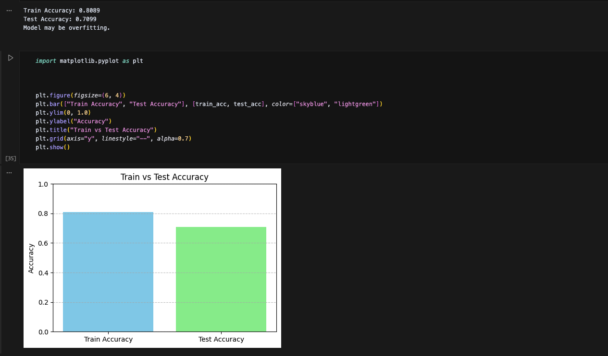

Predicting E-Commerce User Intent Using PySpark and ML

Introduction
This project was chosen due to our keen interest in the e-commerce landscape, particularly within the fast-evolving fashion industry. With aspirations of potentially launching our own brand one day, we believe understanding what drives human purchasing decisions is a critical first step. This project seeks to forecast user intention—such as product viewing, cart addition, or purchase completion—based on interaction data captured by a leading online retailer. The creation of a robust predictive model can provide insightful, practical applications for businesses, guiding initiatives for tailored user experiences and minimizing customer churn. Overall, this model and dataset are compelling because they offer valuable insights into the factors that influence consumer behavior, knowledge that is essential for building a successful, data-driven brand.

Figures
This report incorporates visual aids to narrate the project's methodology and findings effectively. Each figure is accompanied by a descriptive legend, in a style similar to scientific publications, to ensure clarity and support the report's conclusions.

Legend: A comparative bar chart illustrating the final accuracy of the Logistic Regression model. The model achieved an accuracy of 80.89% on the training dataset and 70.99% on the unseen testing dataset. The performance gap is indicative of overfitting.

Methods
This section provides a factual summary of the technical methodologies employed throughout the project, presented in chronological order. This account details the procedural "what" and "how" of our work, with interpretive analysis reserved for the Discussion section.

Data Exploration
Dataset: Kaggle: E-Commerce Behavior Data from Multi-Category Store

Source File: 2019-Nov.csv

Size: The full dataset contains over 67 million rows. A sample of 100,000 rows was used for initial exploration, and a smaller, balanced sample of 900 rows (300 from each event_type) was created for model training to address class imbalance.

Initial Exploration: The initial phase involved loading the dataset into a PySpark DataFrame. We used printSchema() to inspect data types and describe() to generate summary statistics. To understand data distributions, we grouped data by event_type, category_code, and brand. The price distribution by event type was visualized using Seaborn.

Preprocessing
A multi-step preprocessing pipeline was constructed to prepare the dataset for machine learning.

Imputation: To handle missing data, null values within the brand and category_code columns were imputed with the string literal 'unknown'.

Feature Engineering: The feature set was augmented with new features: log_price (the log-transformed price to normalize its distribution) and temporal features day and month extracted from the event_time timestamp.

Encoding & Scaling: Categorical features were one-hot encoded using StringIndexer and OneHotEncoder. The consolidated feature vector then underwent standardization using StandardScaler.

Final Feature Set: The final set of features used for modeling includes price, log_price, day, month, and the one-hot encoded categorical columns.

Model 1: Logistic Regression Classifier
The first predictive model implemented was a multi-class Logistic Regression classifier. This model was trained on the fully preprocessed, balanced dataset to classify a user's action.

Model Parameters/Configuration:

# The model was trained using a full preprocessing pipeline and default parameters.
from pyspark.ml.classification import LogisticRegression

lr = LogisticRegression(featuresCol="features", labelCol="label")
lr_model = lr.fit(train_data)

Future Work - Model 2 Candidate: Decision Tree
We plan to train a DecisionTreeClassifier for comparison against the baseline Logistic Regression model.

We will also experiment with reframing the problem as a binary classification task (e.g., purchase vs. no-purchase) to potentially simplify the learning process, especially given the class imbalance.

Results
This section presents an objective summary of the results obtained from the methodologies described above.

Data Exploration Results
EDA confirmed a significant proportion of null values within the brand and category_code features and a highly imbalanced class distribution for event_type, with view events being the most common. This imbalance motivated the creation of a balanced sample for modeling.

Preprocessing Results
The implemented preprocessing pipeline successfully transformed the raw data into a model-ready format with no missing values and a normalized, vectorized feature set.

Model 1: Logistic Regression Results
Training Accuracy: 0.8089

Test Accuracy: 0.7099

Discussion
This section provides an interpretive analysis of the project's workflow and results, discussing the rationale behind our decisions and critically evaluating our findings.

Logistic Regression
We selected Logistic Regression as our initial baseline classifier due to its high interpretability and its native ability to handle multi-class classification problems. The model provided a strong starting point for evaluating the predictability of user intent. The resulting test accuracy of 70.99% indicates that the model learned underlying patterns from the data, but the 10-point drop from training accuracy confirms that the model is overfitting.

Challenges
Several challenges were addressed during the project:

Missing Data: The need to impute missing brand and category_code data was a critical first step before any modeling could occur.

Skewed Distributions: The price values had a heavily skewed distribution. Adding log_price was a necessary transformation to address this and improve the suitability of the data for a linear model.

High Dimensionality: The use of one-hot encoding for categorical variables significantly increased the dimensionality of the feature space, which can contribute to overfitting.

Anticipated Changes in Future Models
Our scientific thinking for future iterations is guided by the results of our baseline model. We anticipate that a Decision Tree may handle non-linear relationships in the data more effectively than Logistic Regression. Furthermore, simplifying the problem to a binary classification task could mitigate challenges associated with the observed class imbalance and potentially lead to a more robust and focused model.

Based on the experiments conducted to date, our final model is the Logistic Regression classifier. We selected this model to establish a foundational, interpretable performance baseline for this classification problem. The final performance of this model on the test set was an accuracy of 70.99%. This result indicates that the model possesses a degree of predictive utility but is fundamentally limited by overfitting to the training data. The subsequent implementation of a Decision Tree model will be a crucial next step to determine if a more complex, non-linear architecture can yield a more generalizable solution.

Conclusion
This project demonstrates the effectiveness of using PySpark to process and model large-scale e-commerce interaction data. Through comprehensive preprocessing—including imputation, feature engineering, and normalization on a balanced sample—we prepared the dataset for predictive modeling. Our initial Logistic Regression model provided a strong baseline for identifying user intent but also highlighted a clear problem with overfitting. Future iterations will incorporate tree-based models and binary classification frameworks to enhance both interpretability and predictive performance, building upon the solid foundation established here.

Statement of Collaboration
Chris Spears: Team Leader, ML Developer, Project Manager, Engineer, Reviewer, Testing and Writer: Modeling, Spark pipeline, Debugging preprocessing, Tested code, provided feedback. Also ensured Repo was organized and ready to upload.

Abran Gonzalez: ML Developer, Engineer, Reviewer, Testing and Writer: Modeling, Spark pipeline, Debugging preprocessing, Tested code, provided feedback.

